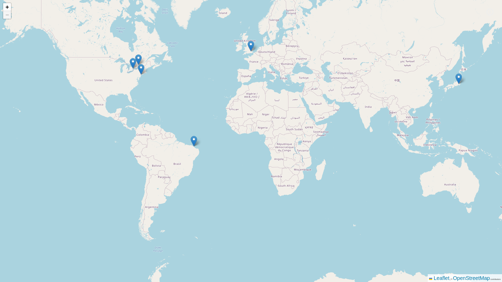

# My Trips

<p align="center">
  <a href="https://my-trips-iamdevmarcos.vercel.app/">
    
  </a>
</p>

## About this Project

This is a project made in [Willian Justen](https://willianjusten.com.br/cursos) course and aims to mark places in the world that I want to visit one day.

Be sure to send your feedback.

## Technology stack

- **Front-end:** [Next.js](https://nextjs.org/)
- **Testing:** [Jest](https://jestjs.io/)
- **Build:** [Vercel](https://vercel.com/)

## Demo of project

[Click Here](https://my-trips-iamdevmarcos.vercel.app/)


## Running locally

1. Clone this repo:

```sh
$ git clone https://github.com/iamdevmarcos/my-trips.git
```

2. Then go to the project's folder:

```sh
cd my-trips
```

3. Install all dependencies:

```sh
yarn install
```

4. Run locally:

```sh
yarn start
```

## Links

Email: marcosdev.me@gmail.com

LinkedIn: [Marcos Andre](https://www.linkedin.com/in/iamdevmarcos/)

Website: [marcosdev.me](https://marcosdev.me/)


## Autor

| [<br><sub>@iamdevmarcos</sub>](https://github.com/iamdevmarcos) |
| :---------------------------------------------------------------------------------------------------------------------------------------: |